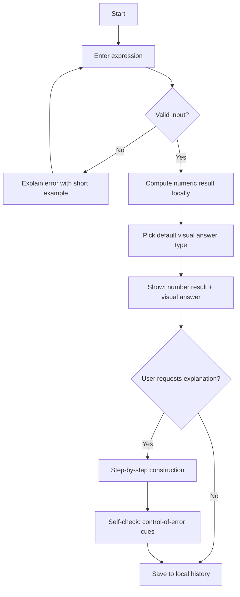

# Visual Montessori-Informed iPhone Calculator for Dyscalculia

## Executive summary

I’m designing for a single problem: standard calculators return *symbols*, but many people with dyscalculia need *meaning* and *error resistance* as much as they need speed. Dyscalculia is commonly discussed as persistent difficulty with number concepts, number facts, calculation, and mathematical reasoning, and it can persist into adulthood and affect school, work, and daily life. citeturn15search0turn15search3turn6search17

My core recommendation is a dual-output calculator:

- **Symbolic output**: the expression and numeric result, always available.
- **Visual output**: a chosen “visual answer” that shows the *same* result through quantity, structure, and magnitude checks (for example, number line jumps, place-value blocks, dot patterns, arrays, area models, and stepwise constructions). This is aligned with evidence that number-line–focused training can improve aspects of spatial number representation and math performance in children with developmental dyscalculia. citeturn0search0turn6search9

I ground the design in Montessori principles taken from primary Montessori text:

- **Concrete-to-abstract progression**: Montessori describes guiding learners “from sensations to ideas,” and explicitly “from the concrete to the abstract.” citeturn14view0turn14view1
- **Sensorial materials**: repeated sense exercises refine discrimination and support learning. citeturn12view0
- **Self-correction (control of error)**: Montessori describes material that “controls every error,” enabling auto-correction and auto-education. citeturn12view0
- **Freedom within limits**: Montessori frames liberty with boundaries, noting liberty should have limits tied to collective interest and social order. citeturn13view2turn13view3

Assumptions (because you left these unspecified):

- **Target age range**: broad, spanning children through adults, with “adult-first” defaults and optional scaffolding. (Assumption)
- **Privacy posture**: local-first by default, with optional opt-in cloud sync. (Assumption)
- **Budget and timeline**: small product team shipping an MVP in a few months, then v1 and v2 iterations. I label all effort estimates as illustrative. (Assumption)

## Evidence base and implications for dyscalculia-friendly calculation

I design around three recurring themes in the dyscalculia literature: heterogeneity, number sense and magnitude, and working-memory constraints.

**Dyscalculia and math difficulties are heterogeneous.** A recent review emphasizes ongoing debate about exact mechanisms and frequency of developmental dyscalculia, and highlights individual differences in profiles. citeturn6search0 This matters because a single visual model will not serve everyone equally well.

**Number-to-space representations are a high-leverage visual channel.** A well-cited intervention study trained children with developmental dyscalculia using a computer-based number-line game and reported improvements on outcomes tied to number-line representation and broader math performance measures. citeturn0search0 This supports making the number line a first-class “visual answer” for addition, subtraction, and magnitude sanity checks.

**Working memory constraints can be a core friction point, including in adults.** Research links developmental dyscalculia and math difficulties with working-memory factors, including visuo-spatial and inhibitory components. citeturn6search8turn15search18 Studies also show serial-order working-memory impairments in adults with dyscalculia. citeturn15search1turn15search13 For app design, this argues for reducing multi-step mental bookkeeping through externalized steps, segmentation, and user-paced explanations.

**Adults matter, not only children.** Work on dyscalculia in early adulthood reports that adults can be aware of their numerical difficulties, with impacts on academic and occupational decisions, and explicitly calls for age-appropriate support. citeturn6search17 This is why I treat “respectful adult UX” as a primary requirement, not a later extension.

**Concrete-to-abstract instruction has supportive evidence beyond Montessori.** The concrete–representational–abstract (CRA) instructional approach, which moves from manipulatives to visuals to symbols, has a recent meta-analytic review supporting its effectiveness as a math intervention across included studies. citeturn7search1 I treat this as convergent validation: Montessori’s sequencing is consistent with broader evidence-based instructional framing.

**Cognitive load is not an abstract principle here. It is a product requirement.** Cognitive Load Theory formalizes that working memory is limited and instructional formats can impose unnecessary (extraneous) load. citeturn10search0 For this app, “reduce cognitive load” operationalizes into: fewer simultaneous elements, progressive disclosure, user-paced steps, and minimal motion in frequent interactions, consistent with Apple guidance on motion. citeturn10search0turn9search2

## Montessori principles translated into app mechanics

I treat Montessori principles as engineering constraints, not decoration.

### Montessori principles mapped to app features

| Montessori principle | Primary-source grounding | What it means in an app | Concrete feature decisions I would make |
|---|---|---|---|
| Concrete-to-abstract progression | Montessori describes leading from “sensations to ideas” and “from the concrete to the abstract.” citeturn14view0turn14view1 | Users should be able to start with quantity and structure, then move to symbols when ready | Default to a visual answer pane for new users; allow “Symbols-only” mode but keep a one-tap “visual check” always available |
| Sensorial materials | Montessori describes repeated sense exercises refining perception and supporting auto-education. citeturn12view0 | Learning and verification should use perception and action, not only reading digits | Use tappable, draggable manipulatives; use spatial grouping and tactile cues; keep visuals crisp, not decorative |
| Self-correction, control of error | Montessori describes didactic material that “controls every error,” leading children to correct themselves. citeturn12view0 | The system should help users *detect and correct* errors without shame and without heavy text | Build “control-of-error” constraints: snap-to-place-value bins, regrouping rules that must balance, and “inconsistency cues” when the visual model and symbolic result diverge |
| Freedom within limits | Montessori frames liberty with limits tied to collective interest and good conduct. citeturn13view2turn13view3 | Users choose pace and representation, but choices must be bounded to prevent overload | Offer 2–3 visual answer options per operation type, not a long list; allow speed control and step control; cap simultaneous overlays |
| Limit the field of consciousness, isolate the difficulty | Montessori describes limiting the field of consciousness to the object of a lesson and limiting intervention. citeturn13view3turn12view0 | Avoid split attention and clutter | Progressive disclosure: show one primary representation by default; hide advanced toggles under “More”; avoid simultaneous animations and dense text |

A Montessori-aligned calculator should feel like a “prepared environment”: predictable structure, limited choices, and tools that embed feedback so the user can self-correct. citeturn12view0turn13view3

## Visual answer system and interaction patterns

### Core accessibility goals, operationalized

I treat your three goals as testable product properties:

- **Reduce cognitive load**: keep the default screen calm; avoid frequent motion; minimize simultaneous controls; provide user-paced step segmentation. citeturn10search0turn9search2turn10search9
- **Support number sense**: emphasize magnitude, grouping, and number-to-space mappings. citeturn0search0turn6search0
- **Multi-sensory feedback**: pair visual feedback with optional haptic and audio cues, designed as supplemental feedback consistent with Apple guidance. citeturn11search14turn11search2

### Visual answer types compared

I design visual answers as interchangeable “renderers” that all obey the same truth constraint: the visual model must match the computed result and expose structure (place value, grouping, magnitude).

| Visual answer type | Best-fit operations | Benefits for dyscalculia | Risks and mitigations | Montessori fit |
|---|---|---|---|---|
| Number line (animated jumps, with step controls) | Add, subtract; fraction magnitude extensions | Externalizes magnitude and “distance”; research supports number-line training benefits in DD contexts. citeturn0search0 | Motion sensitivity and distraction. Respect Reduced Motion and avoid constant motion in frequent interactions. citeturn9search5turn9search2 | Concrete-to-abstract via spatial mapping; repeatable, self-paced practice. citeturn14view0 |
| Manipulatives (base-ten blocks or bead-like units) | Multi-digit add/subtract with regrouping; place value checks | Makes place value and regrouping explicit; supports CRA-style sequencing. citeturn7search1 | Visual clutter for large numbers. Use grouping (tens, hundreds) and zoom or collapse. | Sensorial and concrete; supports control-of-error constraints. citeturn12view0 |
| Dot patterns (ten-frames, canonical dot cards) | Small-number composition, early number sense | Builds “instantly seeing how many” and grouping, aligned with subitizing instruction. citeturn7search0 | Subitizing deficits are not consistent across all math difficulties; offer alternatives. citeturn15search2turn15search25 | Sensorial pattern discrimination; repeatable. citeturn12view0 |
| Arrays and area models | Multiplication meaning, distributive structure | Supports structure and decomposition | Can confuse if shown without clear labeling; keep optional and paired with number line or symbolic explanation | Representational bridge |
| Color-coded place value (plus non-color cues) | Magnitude sanity checks, reading multi-digit numbers | Instant structure cue; can prevent order-of-magnitude mistakes | Must not rely on color alone. Support “Differentiate Without Color Alone” and provide labels/patterns. citeturn1search2turn4search7 | Isolates difficulty by highlighting one property at a time. citeturn13view3 |
| Step-by-step animated constructions | Any operation where procedure drives errors | Segments steps and reduces working-memory burden; supports user-paced segmentation. citeturn10search9turn10search5 | Risk of overload if too verbose. Keep each step short and user-controlled. | Montessori “limit intervention” and guide progression; supports self-correction. citeturn13view3turn12view0 |

### Visual references for Montessori-style materials and math representations

image_group{"layout":"carousel","aspect_ratio":"1:1","query":["Montessori golden beads decimal system material","Montessori number rods material","ten frame dot pattern educational","number line math manipulatives"],"num_per_query":1}

### Interaction patterns

I use two modes because “fast calculation” and “learning construction” have different cognitive and time requirements.

**Compute mode (default):** fast entry, instant answer, compact visual check.

**Construct mode (optional):** drag, group, and step through a representation with control-of-error feedback.

Interaction components, grounded in iOS guidance:

- **Touch targets and spacing:** I keep primary hit targets at least 44 by 44 points. citeturn11search0turn11search3
- **Drag and drop manipulatives:** I follow Apple drag-and-drop guidance and provide feedback when drops require time or processing. citeturn17search15turn2search17
- **Accessible equivalents for gestures:** for any drag interaction, I add VoiceOver and Switch Control alternatives using custom actions or adjustable actions, reducing the number of swipes needed. citeturn9search7turn9search22turn9search0
- **Haptic and audio feedback:** I use SwiftUI SensoryFeedback for simple cues and UIKit feedback generators where appropriate, following Apple’s haptics guidance. citeturn11search2turn11search1turn11search14
- **Adjustable pace:** I make animations user-paced and provide step controls; I respect system Reduced Motion and adapt or replace problematic motion. citeturn9search5turn9search11turn10search5

### Mermaid flowchart for a core user flow



### Sample wireframes and annotated diagrams

These are diagrams, not final visual design.

**Compute mode: numeric answer plus “visual check” drawer**

```text
┌──────────────────────────────────────────────┐
│ Expression                                   │
│  48 + 17                                     │
│                                              │
│ Result                                       │
│  65                                          │
│                                              │
│ Visual check (tap to expand)                 │
│  Number line: 48 → 58 → 65                   │
│  (show steps)  (change visual)               │
└──────────────────────────────────────────────┘
┌──────────────────────────────────────────────┐
│ Keypad                                       │
│ 7 8 9  ÷                                     │
│ 4 5 6  ×                                     │
│ 1 2 3  −                                     │
│ 0 . ⌫  +   =                                 │
└──────────────────────────────────────────────┘
Annotations:
- One primary visual by default to limit clutter.
- “Change visual” shows only 2–3 alternatives.
```

**Construct mode: place value with regrouping control-of-error**

```text
┌──────────────────────────────────────────────┐
│ Build: 48 + 17                               │
│                                              │
│ Tens bin        Ones bin                     │
│ [||||] [|]      [••••••••] [•••••••]         │
│  4 tens  1 ten   8 ones     7 ones            │
│                                              │
│ Regroup rule: 10 ones → 1 ten                │
│ [Regroup 10 ones]  [Undo]  [Check]           │
│                                              │
│ Result: 6 tens and 5 ones = 65               │
└──────────────────────────────────────────────┘
Annotations:
- “Regroup 10 ones” is the accessible alternative to drag.
- If bins do not balance, “Check” explains mismatch.
```

## iOS implementation, accessibility, privacy, and performance

### SwiftUI and UIKit: what I would choose and why

I would implement the app shell in SwiftUI, and treat the visual-answer workspace as the main technical risk area.

- **SwiftUI for the app shell:** calculator layout, history, settings, onboarding, and standard UI. Apple emphasizes SwiftUI’s ability to provide rich accessibility elements and the tooling to tailor accessibility via modifiers. citeturn9search25turn11search5
- **SwiftUI Canvas for efficient drawing:** Apple notes Canvas can improve performance for drawing that is not primarily text. citeturn17search9
- **UIKit interop when needed:** if hit-testing, complex gesture state, or performance profiling shows SwiftUI limitations, I would embed a UIKit view for the manipulative workspace to keep interactions stable, while keeping SwiftUI for the rest. Apple documentation highlights evolving interoperability and performance analysis pathways across the stack. citeturn17search30turn17search0

I keep the architecture modular: computation engine, visual renderer(s), interaction layer, and accessibility adapter.

### iOS accessibility specifics I treat as non-negotiable

**VoiceOver:** I follow Apple’s VoiceOver guidance and ensure every common task can be completed with VoiceOver, including custom actions for complex elements like manipulatives. citeturn3search1turn4search5turn9search22turn9search7

**Dynamic Type and Larger Text:** I support scalable type sizes and test at accessibility sizes. Apple provides Dynamic Type APIs in SwiftUI and explicit evaluation criteria that reference scaling and usability at large sizes. citeturn1search3turn4search2turn3search2

**Contrast and color independence:** I avoid encoding meaning purely by color and test under “Differentiate Without Color Alone” as Apple recommends, and I use sufficient contrast guidance as an acceptance gate. citeturn1search2turn0search3turn4search7

**Dark Mode and Dark Interface:** I implement Dark Mode and verify common tasks remain usable in dark appearance, consistent with Apple HIG and evaluation guidance. citeturn4search3turn4search0turn4search11

**Reduced Motion:** I avoid problematic motion triggers and provide alternative transitions or user-controlled stepping, consistent with Apple’s Reduced Motion criteria and motion guidance. citeturn9search5turn9search2turn9search8turn9search11

**Touch target sizing:** I keep hit targets 44 by 44 points minimum for frequent controls. citeturn11search0turn11search3

**Accessibility testing:** I bake accessibility testing into definition-of-done using Apple’s testing guidance and the Accessibility Nutrition Labels evaluation pathway, so what I claim on the App Store is defensible. citeturn1search19turn4search6turn7search3

### Privacy, data, and optional cloud sync

I would ship a local-first calculator that works without accounts.

- **Local storage:** Core Data is explicitly positioned for saving permanent app data for offline use and caching. citeturn5search3
- **Optional cloud sync:** if enabled, I use CloudKit private database sync and support encrypted fields for sensitive user data, consistent with CloudKit documentation. citeturn3search6turn3search3turn3search19
- **Device-level protection:** I assign appropriate file protection classes so data is encrypted at rest and controlled by device lock state, consistent with Apple’s platform security documentation. citeturn5search1turn5search13
- **App Store privacy disclosures:** I maintain accurate App Privacy Details and align with Apple’s requirements for privacy practices and third-party SDK disclosure. citeturn5search0turn5search4turn5search12

If the app targets children, I would design for minimal data collection and comply with COPPA guidance from the entity["organization","Federal Trade Commission","consumer protection agency"]. citeturn15search0

### Performance and offline usability

Performance is part of accessibility in a dyscalculia-support tool because latency increases the working-memory burden during continuous interactions. Apple’s responsiveness guidance distinguishes continuous interactions as especially sensitive to delay. citeturn17search0

I would adopt these performance constraints:

- **Computation must be local and immediate** for standard arithmetic and visual rendering. (Design requirement)
- **Rendering must be smooth and predictable** in the manipulative workspace; I use Canvas where appropriate and profile SwiftUI performance issues using Apple’s tooling guidance. citeturn17search9turn17search30
- **Offline-first**: everything works without network; cloud sync is additive. citeturn5search3turn3search6

## Evaluation plan and implementation roadmap

### Evaluation plan: how I would prove this works

I would evaluate two dimensions:

- Calculator usability (speed, accuracy, accessibility).
- Meaning support (error detection, magnitude sanity checking, cognitive load).

**Participant strategy:** I recruit participants who identify with dyscalculia or meet screening criteria, across a broad age range because the product is age-inclusive by assumption. I explicitly include adults because adult dyscalculia has documented functional impact and calls for age-appropriate support. citeturn6search17turn15search3

**Study types:**

- Moderated usability testing for workflow and accessibility barriers. citeturn4search5turn1search19
- Comparative baseline testing versus standard calculator tasks.
- Longitudinal pilot for “Construct mode” learning outcomes, if the app intends to be instructional, not only assistive. citeturn7search1turn0search0

**Primary metrics:**

- Task success rate, error rate, and time-to-correct-answer. (Standard usability metrics)
- **Self-correction rate**: proportion of tasks where the user catches and corrects an error using the visual answer. (Key Montessori-aligned outcome)
- **SUS** (System Usability Scale) for subjective usability. citeturn10search2
- **NASA-TLX** workload for perceived cognitive load. citeturn10search11turn10search7
- Representation preference and abandonment by task type, to validate the “freedom within limits” representation chooser. citeturn13view3turn12view0

**A/B tests I would actually run:**

I use A/B testing only where it is ethically low-risk and does not compromise accessibility:

- Onboarding: default mode selection wording and sequencing.
- Default visual per operation: number line vs place-value as default for multi-digit add/subtract.
- Visual drawer design: “always visible” vs “tap to expand.”

I treat A/B testing as complementary to usability testing, consistent with usability research guidance that A/B testing answers narrow quantitative questions and does not replace formative discovery. citeturn16search0turn16search16

### Examples of accessible calculator products I would benchmark

I use these as benchmarks for accessibility disclosure and baseline calculator UX, not as evidence of dyscalculia support.

- PCalc’s App Store page explicitly lists supported accessibility features like VoiceOver, Larger Text, Dark Interface, and Reduced Motion through Accessibility Nutrition Labels. citeturn7search2turn7search3turn7search15
- Myriad Calculator lists support for VoiceOver, Dark Interface, Sufficient Contrast, and Reduced Motion. citeturn8search12
- Dark Digits markets VoiceOver support and Reduced Motion as accessibility-first features. citeturn8search0

These references validate that a calculator-like app can and should publish concrete accessibility commitments via the App Store’s modern labeling system. citeturn7search3turn7search15turn4search6

### Feature-priority roadmap: MVP vs v1 vs v2

| Phase | Who it serves first | Scope | Why this phase is coherent |
|---|---|---|---|
| MVP | Adults and older students who need fast, reliable meaning checks | 4 operations; expression entry; history; one default visual check per operation; user-paced number-line steps; place-value highlight; VoiceOver, Dynamic Type, Sufficient Contrast, Dark Mode, Reduced Motion support; local-first storage | Establishes the “dual-output calculator” with strong platform accessibility from day one. citeturn11search5turn4search2turn0search3turn9search5turn5search3 |
| v1 | Broader age range including younger learners | Visual chooser with 2–3 visuals per operation; manipulatives for regrouping; dot patterns for small numbers; improved onboarding personalization; accessibility actions for manipulatives | Improves fit to heterogeneous profiles and Montessori freedom-within-limits while staying bounded. citeturn6search0turn15search2turn12view0turn13view3turn9search22 |
| v2 | Users who want deeper construction and optional cross-device continuity | Full Construct mode library; guided step-by-step constructions; optional CloudKit sync; export and share; practice sets and adaptive scaffolding | Adds instruction-grade features and optional cloud without breaking local-first trust. citeturn7search1turn3search6turn5search0turn3search3 |

### Implementation milestones with illustrative effort

All estimates are illustrative and assume a small team.

| Milestone | Deliverable | Illustrative effort | Primary risks I would manage |
|---|---|---|---|
| Product definition | Requirements, visual-answer spec, accessibility acceptance criteria | 2–3 weeks | Over-scoping visuals; unclear definition of “common tasks” for accessibility labeling. citeturn4search6turn7search3 |
| Prototype | Interactive number line and place-value visual check; one Construct-mode prototype | 4–6 weeks | Motion sensitivity; unclear control-of-error cues; gesture accessibility gaps. citeturn9search5turn12view0turn9search22 |
| MVP build | Shippable app with local history, accessibility baseline, offline-first visuals | 8–12 weeks | VoiceOver navigation in data-rich visual panes; Dynamic Type layout breakage. citeturn3search1turn4search2turn9search25 |
| Pilot usability | Moderated sessions, SUS and NASA-TLX baseline, iteration | 3–5 weeks | Workload not reduced versus baseline calculator; representation chooser increases cognitive load. citeturn10search2turn10search11turn10search0 |
| v1 release | Manipulatives, dot patterns, representation chooser, onboarding personalization | 6–10 weeks | Visual clutter; inconsistent learning benefit across profiles; need stronger personalization logic. citeturn6search0turn15search2turn7search0 |
| v2 expansion | Full Construct mode and optional CloudKit sync | 10–16 weeks | Privacy disclosures and opt-in flows; Cloud sync edge cases; performance of complex workspaces. citeturn5search0turn3search6turn17search0